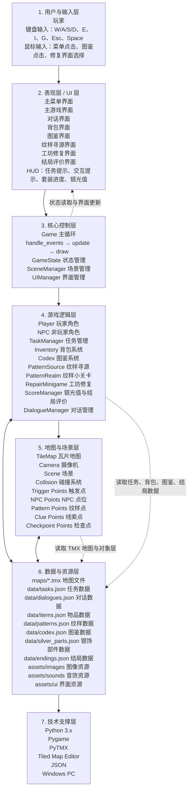
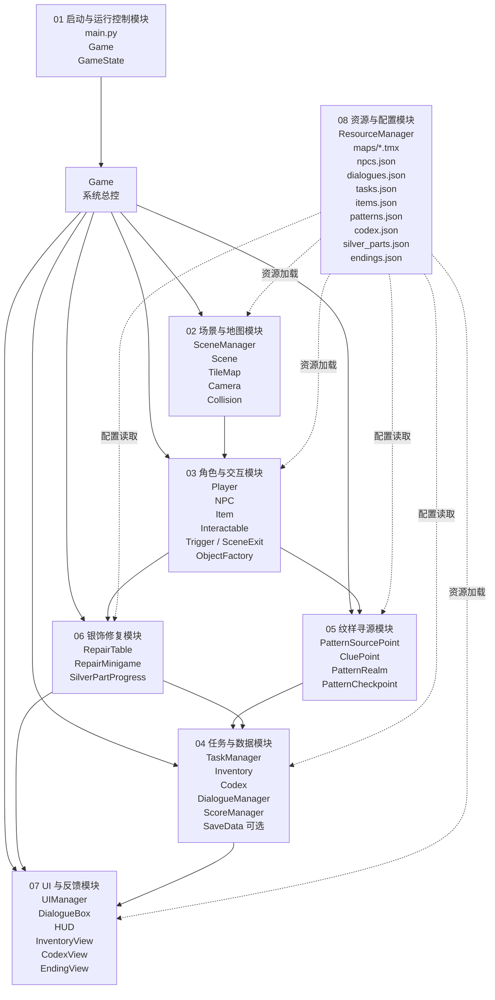
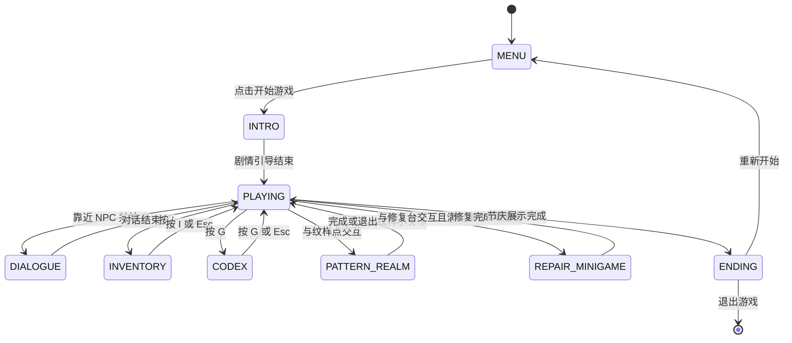
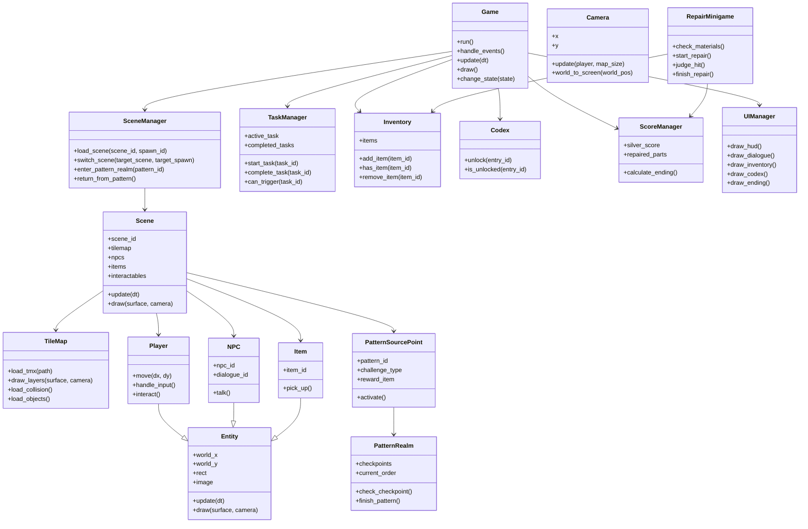
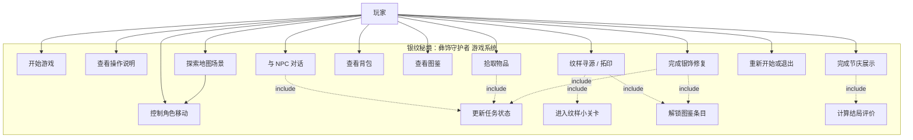

# 《银纹秘境：彝饰守护者》概要设计报告

版本：纹样寻源优化版  
文档形式：Markdown + Mermaid 图表版  
项目类型：Python + Pygame 2D 单人文化修复探索游戏  

---

## 当前实现同步说明（2026-07-01）

本概要设计报告描述完整设计目标。当前课程演示版本已实现的主线为：

```text
村寨长者对话 -> 集市寻源 -> 河谷影纹净化 -> 节庆广场守护 -> Ending
```

当前真实代码结构以 `src/core`、`src/scenes`、`src/maps`、`src/entities`、`src/systems`、`src/ui`、`src/resources`、`src/minigames` 为准。文中旧式单文件结构、完整工坊修复、完整图鉴、存档和多结局等内容属于历史规划或后续扩展。

## 1. 引言

### 1.1 编写目的

本文档用于说明《银纹秘境：彝饰守护者》的软件概要设计方案，重点描述系统总体架构、功能模块划分、核心类设计、数据设计、接口设计、关键流程设计和测试验收思路。

本概要设计报告位于需求规格说明书和详细设计、编码实现之间，主要作用是将已有需求进一步转化为可实现、可拆分、可测试的软件结构，为后续使用 Python、Pygame、Tiled、PyTMX 和 JSON 完成项目开发提供设计依据。

### 1.2 项目背景

《银纹秘境：彝饰守护者》是一款基于 Python + Pygame 开发的 2D 单人离线文化修复探索游戏。玩家扮演“银纹守护者”，在村寨、山地、集市、银饰工坊和节庆广场等场景中探索，寻找银饰碎片，完成纹样寻源，获得纹样拓片，并通过敲银修复小游戏修复节庆银饰套装，最终根据银饰套装完成度、图鉴进度和银光值获得结局评价。

本项目不是传统打怪升级 RPG，也不是简单文化科普页面，而是以地图探索、任务推进、纹样寻源、道具收集、银饰修复、图鉴解锁和结局评价为核心的 2D 文化修复探索 Demo。

### 1.3 设计依据

本概要设计主要依据以下文档完成：

1. 《游戏策划》；
2. 《软件需求规格说明书 SRS》；
3. 《功能规格说明书 FSD》；
4. 《结构化地图设计文档》；
5. 《开发规范文档》。

### 1.4 术语说明

| 术语 | 说明 |
|---|---|
| 纹样寻源 | 玩家通过自然场景、生活场景或纹样空间小关卡理解纹样来源并获得拓片的过程。 |
| 纹样拓片 | 完成纹样寻源后获得的道具，用于后续银饰修复。 |
| 纹样空间 | 独立的小型关卡地图，玩家通过走纹样路径、对齐拓印纸或描摹关键点完成挑战。 |
| 敲银修复 | 玩家在银饰工坊中使用拓片和材料，通过时机判定完成银饰修复。 |
| 银光值 | 用于评价玩家修复表现、图鉴收集、隐藏收集和支线完成度的分数。 |
| 节庆银饰套装 | 玩家需要逐步修复的银饰部件集合，如银耳环、银手镯、银项圈、银铃等。 |
| 游戏化转译 | 将文化元素转化为游戏机制，不将缺少明确出处的寓意写成绝对民俗结论。 |

---

## 2. 系统总体设计

### 2.1 系统定位

本系统定位为 PC 端单人离线 2D 文化修复探索游戏 Demo。系统采用 Python 语言开发，使用 Pygame 进行窗口、绘制、事件处理和音效播放，使用 Tiled Map Editor 制作地图，使用 PyTMX 读取 TMX 地图文件，使用 JSON 文件管理 NPC、任务、道具、对话、图鉴、纹样和结局等数据。

### 2.2 设计目标

系统设计目标如下：

1. 实现从主菜单到结局评价的完整游戏流程；
2. 支持玩家在大于视窗的地图中移动和探索；
3. 支持摄像机跟随、碰撞检测和场景切换；
4. 支持通过 Tiled 对象层配置 NPC、道具、纹样寻源点、线索点、检查点和出口；
5. 支持 NPC 对话、任务推进、背包记录和图鉴解锁；
6. 支持纹样寻源和纹样空间小关卡；
7. 支持工坊敲银修复小游戏；
8. 支持银饰套装进度、银光值和结局评价；
9. 采用模块化和面向对象设计，避免所有逻辑集中在 main.py 中；
10. 保证系统可运行、可展示、可测试、可扩展。

### 2.3 技术架构

| 类型 | 技术 |
|---|---|
| 开发语言 | Python 3.x |
| 游戏框架 | Pygame |
| 地图编辑工具 | Tiled Map Editor |
| 地图读取库 | PyTMX |
| 数据存储 | JSON |
| 运行平台 | Windows PC |
| 开发工具 | VS Code / PyCharm |
| 版本管理 | Git |

### 2.4 总体运行流程

```text
启动游戏
→ 主菜单
→ 剧情引导
→ 村寨入口
→ NPC 对话
→ 拾取银饰碎片
→ 前往银饰工坊
→ 获得修复目标
→ 前往山地或集市
→ 完成纹样寻源
→ 获得纹样拓片
→ 收集修复材料
→ 返回工坊
→ 敲银修复
→ 点亮银饰部件
→ 解锁图鉴
→ 前往节庆广场
→ 结局评价
```

### 2.5 系统边界

#### 2.5.1 系统包含内容

1. 游戏启动与主菜单；
2. 玩家移动；
3. 地图加载与摄像机跟随；
4. 碰撞检测；
5. 场景切换；
6. NPC 对话；
7. 任务系统；
8. 背包系统；
9. 纹样寻源系统；
10. 纹样空间小关卡；
11. 工坊修复小游戏；
12. 图鉴系统；
13. 银光值与结局评价；
14. 基础音效与视觉反馈。

#### 2.5.2 系统不包含内容

1. 多人联机；
2. 登录注册；
3. 排行榜；
4. 商店交易；
5. 复杂战斗系统；
6. 大型开放世界；
7. 复杂 AI 敌人；
8. 真实图像识别式拓印；
9. 商业级动画系统。

---

## 3. 软件架构设计

### 3.1 分层架构设计

系统采用分层架构，整体划分为七层：

| 层级 | 职责 |
|---|---|
| 用户与输入层 | 负责接收玩家键盘和鼠标输入。 |
| 表现层 | 负责主菜单、主游戏界面、对话、背包、图鉴、修复、结局评价和 HUD 展示。 |
| 核心控制层 | 负责主循环、状态切换、模块调度和全局数据管理。 |
| 游戏逻辑层 | 负责玩家、NPC、道具、任务、背包、纹样寻源、修复、图鉴和评分。 |
| 地图与场景层 | 负责加载 TMX 地图、绘制图层、读取对象层、管理场景切换。 |
| 数据与资源层 | 负责 JSON 数据、TMX 地图、图片、音效、UI 资源的加载与存储。 |
| 技术支撑层 | 负责 Python、Pygame、PyTMX、Tiled、JSON 和 Windows 运行环境。 |

### 3.2 系统总体架构图



### 3.3 模块结构图



### 3.4 主循环设计

Pygame 主循环采用三段式结构：

```python
while self.running:
    self.handle_events()
    self.update(dt)
    self.draw()
```

其中：

1. `handle_events()` 负责处理键盘、鼠标和退出事件；
2. `update(dt)` 负责更新玩家、场景、任务、碰撞、小游戏状态；
3. `draw()` 负责绘制地图、角色、对象、前景和 UI。

系统规定 `draw()` 阶段只负责显示，不修改任务、背包、图鉴、银光值等核心数据。

### 3.5 游戏状态流转图



### 3.6 数据驱动设计

系统采用“地图对象层 + JSON 配置”的数据驱动方式。

地图中的 NPC、道具、场景出口、纹样寻源点、自然线索点、检查点和碰撞区域尽量通过 Tiled 对象层配置。任务、对话、道具、图鉴、纹样、银饰部件和结局评价通过 JSON 文件配置。这样可以减少硬编码，方便后期修改地图和任务内容。

---

## 4. 功能模块概要设计

### 4.1 游戏启动与主菜单模块

该模块负责初始化 Pygame、创建游戏窗口、加载标题界面，并提供开始游戏和退出游戏入口。玩家点击“开始游戏”后，系统初始化任务、背包、图鉴、分数和场景数据，并进入剧情引导或村寨入口。

#### 输入

1. 鼠标点击开始按钮；
2. 鼠标点击退出按钮；
3. Enter 确认，可选；
4. Esc 退出，可选。

#### 输出

1. 游戏标题；
2. 开始按钮；
3. 退出按钮；
4. 状态切换结果。

### 4.2 游戏状态管理模块

该模块负责统一管理游戏状态，避免地图探索、对话、背包、图鉴、纹样空间、修复小游戏和结局界面之间发生逻辑混乱。非 PLAYING 状态下，玩家不能继续在主地图移动。

### 4.3 地图与场景模块

该模块负责加载 Tiled 制作的 TMX 地图文件，绘制地图图层，读取对象层数据，并管理不同场景之间的切换。

#### 主要场景

| 场景 ID | 文件名 | 作用 |
|---|---|---|
| village | village.tmx | 村寨入口，新手引导与主线起点 |
| workshop | workshop.tmx | 银饰工坊，修复台与银饰套装展示 |
| market | market.tmx | 山地集市，材料收集与 NPC 线索 |
| mountain | mountain.tmx | 自然场景，纹样寻源与隐藏收集 |
| festival | festival.tmx | 节庆广场，最终展示与结局评价 |
| pattern_mountain | pattern_mountain.tmx | 山纹路径小关卡 |
| pattern_water | pattern_water.tmx | 水波纹小关卡 |
| pattern_sun | pattern_sun.tmx | 太阳纹或火纹小关卡 |

### 4.4 摄像机与视窗模块

该模块负责在地图大于视窗时实现摄像机跟随。玩家在地图中移动时，摄像机根据玩家世界坐标计算偏移量，并限制在地图边界以内，避免显示地图外空白区域。

坐标转换公式为：

```text
screen_x = world_x - camera_x
screen_y = world_y - camera_y
```

摄像机边界限制为：

```text
0 ≤ camera_x ≤ map_width - viewport_width
0 ≤ camera_y ≤ map_height - viewport_height
```

### 4.5 玩家角色模块

该模块负责玩家角色的移动、碰撞、交互和基础动画。玩家通过 WASD 或方向键移动，通过 E 键与 NPC、道具、纹样点、线索点、修复台和场景出口交互。

### 4.6 碰撞检测模块

该模块负责从地图 collision 层读取不可通行区域，并在玩家移动前进行预测碰撞检测。玩家不能穿越房屋、树木、摊位、墙体、地图边界和纹样空间路径边界。

#### 碰撞流程

```text
读取玩家输入
→ 计算 next_rect
→ 判断是否越界
→ 判断是否与 collision_rects 重叠
→ 若发生碰撞则取消移动
→ 若无碰撞则更新玩家位置
```

### 4.7 对象层读取模块

该模块负责读取 Tiled 对象层，并根据对象 `type` 创建对应游戏对象。

| type | 说明 |
|---|---|
| spawn | 玩家出生点 |
| scene_exit | 场景切换出口 |
| npc | NPC 点位 |
| item | 可拾取物品 |
| hidden_collectible | 隐藏银纹碎片 |
| pattern_source | 纹样寻源入口 |
| clue | 自然场景线索点 |
| pattern_checkpoint | 纹样空间检查点 |
| repair_table | 工坊修复台 |
| display_table | 节庆展示台 |
| collision | 碰撞区域 |

### 4.8 NPC 与对话模块

该模块负责 NPC 显示、交互检测和对话触发。NPC 对话内容从 JSON 文件读取，不同任务状态下可显示不同对话。NPC 可用于发布任务、提供纹样线索、提示材料缺失和触发结局展示。

### 4.9 任务模块

该模块负责管理主线任务和支线任务。任务系统记录当前任务、已完成任务和任务触发条件，并根据玩家对话、拾取、寻源、修复等行为推进任务状态。

#### 主线任务示例

```text
main_01：与村寨长者对话
main_02：拾取第一块银饰碎片
main_03：前往银饰工坊
main_04：完成山纹寻源
main_05：返回工坊修复银饰
main_06：前往节庆广场完成展示
```

### 4.10 物品与背包模块

该模块负责记录玩家获得的银饰碎片、银丝材料、纹样拓片、修复锤、隐藏银纹碎片等物品。背包模块为修复系统、图鉴系统和任务系统提供物品查询能力。

### 4.11 纹样寻源模块

该模块是本项目的特色模块。玩家通过自然场景寻源、走纹样迷宫、纹样对齐或关键点描摹获得纹样拓片。标准版本优先实现 `source_hunt` 和 `path_maze`，其他玩法作为扩展。

| 类型 | 说明 |
|---|---|
| source_hunt | 自然场景寻源 |
| path_maze | 走纹样迷宫 |
| align_rubbing | 纹样对齐 |
| point_trace | 关键点描摹 |

### 4.12 纹样空间模块

该模块负责加载纹样空间地图，并根据 `checkpoint_points` 中的检查点顺序判断玩家是否完成纹样路径。玩家按顺序经过全部检查点后，系统发放对应纹样拓片，更新背包、任务和图鉴，并返回原场景。

### 4.13 工坊修复模块

该模块负责银饰工坊中的修复逻辑。玩家靠近修复台后，系统检查背包中是否拥有所需材料和纹样拓片。如果条件满足，则进入敲银修复小游戏；如果条件不满足，则提示玩家返回对应场景收集材料或拓片。

### 4.14 图鉴模块

该模块负责管理银饰图鉴和纹样图鉴。玩家完成纹样寻源或银饰修复后，系统解锁对应图鉴条目。图鉴内容用于展示简短文化说明和游戏内获得方式。

### 4.15 银光值与结局评价模块

该模块负责记录银光值、银饰套装进度、图鉴进度、隐藏收集和支线任务完成情况。游戏结尾根据这些数据生成结局评价，例如普通结局、良好结局或完整守护者结局。

### 4.16 UI/HUD 模块

该模块负责绘制当前任务提示、交互提示、背包界面、图鉴界面、银饰套装进度、银光值、对话框和结局界面。UI 不写入地图图层，而是在程序绘制阶段单独绘制。

---

## 5. 核心类设计

### 5.1 类设计原则

系统采用面向对象设计，遵循以下原则：

1. 一个类只负责一类清晰职责；
2. 地图、玩家、NPC、任务、背包、图鉴、修复和评分分离；
3. main.py 只负责启动游戏；
4. 游戏数据尽量从 JSON 和 Tiled 对象层读取；
5. 绘制逻辑和状态更新逻辑分离；
6. 核心模块之间通过清晰方法调用协作，不直接互相修改内部数据。

### 5.2 核心类职责表

| 类名 | 职责 |
|---|---|
| Game | 游戏入口、主循环、状态切换、全局模块调度 |
| SceneManager | 场景加载、场景切换、纹样空间返回 |
| Scene | 单个场景对象管理 |
| TileMap | TMX 地图加载、图层绘制、对象层解析 |
| Camera | 摄像机跟随、边界限制、坐标转换 |
| Entity | 玩家、NPC、道具等对象的父类 |
| Player | 玩家移动、碰撞、交互 |
| NPC | NPC 对话和任务触发 |
| Item | 道具拾取 |
| Interactable | 可交互对象父类 |
| PatternSourcePoint | 纹样寻源入口 |
| PatternRealm | 纹样空间检查点逻辑 |
| PatternCheckpoint | 纹样检查点 |
| RepairTable | 工坊修复台 |
| RepairMinigame | 敲银修复小游戏 |
| TaskManager | 任务状态管理 |
| Inventory | 背包数据管理 |
| Codex | 图鉴数据管理 |
| ScoreManager | 银光值和结局评价 |
| UIManager | HUD、对话框、背包、图鉴绘制 |
| ResourceManager | 图片、音效、字体和 JSON 数据加载 |

### 5.3 UML 类图



### 5.4 用例图



---

## 6. 数据设计

### 6.1 数据文件设计

系统数据主要存放在 `data` 目录下，建议包括：

| 文件 | 作用 |
|---|---|
| npcs.json | NPC 基础信息 |
| dialogues.json | NPC 对话内容 |
| tasks.json | 主线和支线任务 |
| items.json | 道具数据 |
| patterns.json | 纹样寻源配置 |
| silver_parts.json | 银饰部件和修复条件 |
| codex.json | 银饰图鉴和纹样图鉴 |
| endings.json | 结局评价规则 |
| save.json | 本地存档，可选 |

### 6.2 全局运行数据设计

系统运行期间至少维护以下数据：

| 数据 | 说明 |
|---|---|
| current_scene | 当前场景 |
| player_position | 玩家世界坐标 |
| active_task | 当前任务 |
| completed_tasks | 已完成任务 |
| inventory | 背包物品 |
| completed_patterns | 已完成纹样 |
| pattern_rubbings | 已获得拓片 |
| collected_clues | 已收集线索 |
| repaired_parts | 已修复银饰部件 |
| unlocked_codex | 已解锁图鉴 |
| silver_score | 银光值 |
| completed_side_tasks | 已完成支线任务 |

### 6.3 地图对象数据设计

Tiled 对象层中的对象至少包含 `id` 和 `type` 字段。不同对象根据类型增加不同属性。

#### NPC 示例

```text
id: elder
name: 村寨长者
type: npc
dialogue_id: elder_dialogue
task_id: main_01
```

#### 道具示例

```text
id: silver_fragment_01
name: 银饰碎片
type: item
item_type: fragment
codex_unlock: silver_earring
```

#### 纹样寻源点示例

```text
id: pattern_mountain
name: 山纹寻源点
type: pattern_source
pattern_id: mountain_pattern
challenge_type: path_maze
reward_item: mountain_pattern_rubbing
target_scene: pattern_mountain
return_scene: mountain
codex_unlock: codex_mountain_pattern
required_task: main_04
```

#### 检查点示例

```text
id: mountain_checkpoint_01
type: pattern_checkpoint
pattern_id: mountain_pattern
order: 1
next_checkpoint: mountain_checkpoint_02
```

#### 场景出口示例

```text
id: exit_to_workshop
type: scene_exit
target_scene: workshop
target_spawn: workshop_entry
required_task: main_02
locked_message: 先完成当前任务，再去银饰工坊。
```

### 6.4 本地存档数据设计

可选实现 `save.json`，用于保存玩家当前进度。

```json
{
  "current_scene": "workshop",
  "player_position": [320, 480],
  "active_task": "main_05",
  "completed_tasks": ["main_01", "main_02", "main_03", "main_04"],
  "inventory": ["silver_fragment_01", "mountain_pattern_rubbing", "silver_thread"],
  "completed_patterns": ["mountain_pattern"],
  "repaired_parts": ["silver_earring"],
  "unlocked_codex": ["codex_silver_earring", "codex_mountain_pattern"],
  "silver_score": 60
}
```

---

## 7. 接口设计

### 7.1 用户输入接口

| 输入 | 功能 |
|---|---|
| W/A/S/D 或方向键 | 控制玩家移动 |
| E | 对话、拾取、交互、进入纹样点、使用修复台 |
| I | 打开或关闭背包 |
| G | 打开或关闭图鉴 |
| Esc | 返回、关闭界面或暂停 |
| 空格 | 敲银时机判定，可选 |
| 鼠标点击 | 菜单、图鉴、修复界面选择 |

### 7.2 地图文件接口

系统通过 PyTMX 读取 `maps` 目录下的 TMX 文件。地图文件包括主地图和纹样空间地图：

```text
village.tmx
workshop.tmx
market.tmx
mountain.tmx
festival.tmx
pattern_mountain.tmx
pattern_water.tmx
pattern_sun.tmx
```

### 7.3 JSON 数据接口

系统通过 `ResourceManager` 或 `DataLoader` 读取 JSON 文件。各模块不直接硬编码大量文本，而是通过数据 id 获取对应内容。

### 7.4 UI 输出接口

`UIManager` 负责将任务提示、交互提示、银光值、套装进度、背包、图鉴、修复界面和结局评价绘制到屏幕上。UI 层不直接修改核心数据，只根据当前状态和数据进行展示。

---

## 8. 关键流程设计

### 8.1 游戏主流程图


### 8.2 游戏启动流程

```text
运行 main.py
→ 创建 Game 对象
→ 初始化 Pygame
→ 加载资源
→ 初始化 TaskManager、Inventory、Codex、ScoreManager
→ 进入 MENU 状态
→ 玩家点击开始
→ 加载 village 场景
→ 进入 PLAYING 状态
```

### 8.3 场景切换流程

```text
玩家进入 scene_exit 区域
→ 按 E 触发交互
→ 系统读取 target_scene 和 target_spawn
→ 检查 required_task
→ 条件满足则保存当前全局数据
→ 卸载当前场景
→ 加载目标场景
→ 玩家出现在目标出生点
```

### 8.4 NPC 对话与任务推进流程

```text
玩家靠近 NPC
→ 按 E 交互
→ 系统读取 NPC dialogue_id
→ 根据当前任务状态选择对话
→ 显示对话框
→ 对话结束后更新任务状态
→ 可能解锁新场景、新道具或新纹样线索
```

### 8.5 纹样寻源流程

```text
玩家靠近纹样寻源点
→ 按 E 交互
→ 检查 required_task
→ 读取 pattern_id 和 challenge_type
→ 若为 source_hunt，则进入线索收集流程
→ 若为 path_maze，则进入纹样空间地图
→ 完成挑战后获得 reward_item
→ 拓片加入背包
→ 解锁图鉴
→ 更新任务
→ 返回原场景
```

### 8.6 敲银修复流程

```text
玩家靠近修复台
→ 按 E 交互
→ 进入修复选择界面
→ 选择银饰部件
→ 检查所需材料和纹样拓片
→ 条件不足则显示提示
→ 条件满足则进入敲银小游戏
→ 根据命中结果计算修复表现
→ 点亮银饰部件
→ 更新套装进度和银光值
→ 解锁图鉴
```

### 8.7 结局评价流程

```text
玩家进入节庆广场
→ 与主持人或展示台交互
→ 系统读取 repaired_parts、unlocked_codex、silver_score、completed_side_tasks
→ 计算结局等级
→ 显示结局称号、套装完成度、图鉴进度和银光值
→ 提供重新开始或退出按钮
```

---

## 9. 非功能设计

### 9.1 可维护性设计

系统采用模块化文件结构，每个模块只负责一类功能。`main.py` 只负责启动游戏，具体功能分散在 `game.py`、`scene.py`、`tilemap.py`、`player.py`、`task_manager.py`、`inventory.py`、`codex.py`、`repair_minigame.py` 等文件中，便于后续维护和调试。

### 9.2 可扩展性设计

系统通过 JSON 和 Tiled 对象层驱动游戏内容。后续新增 NPC、道具、纹样、任务或地图时，优先修改配置文件和地图对象层，减少对核心代码的改动。

### 9.3 容错设计

当地图文件、图片、音效或 JSON 数据缺失时，系统应给出控制台提示或使用占位资源，避免程序直接崩溃。对象层属性缺失时，应输出调试信息，方便定位错误。

### 9.4 性能设计

系统为 2D 本地离线游戏，性能压力较小。设计上应避免每帧重复加载图片、音效和 JSON 文件，所有资源应在初始化阶段加载并缓存。地图绘制时只绘制当前视窗范围内可见内容，减少不必要的绘制开销。

### 9.5 文化表达设计

系统中的文化说明应简短、准确、尊重，不编造复杂民俗细节，不将民族文化猎奇化。纹样来源采用“游戏化转译”表达，即将山地、水波、火光、花鸟等自然或生活意象转化为游戏机制，而不是写成未经证实的绝对民俗结论。

---

## 10. 测试与验收设计

### 10.1 模块测试

| 测试模块 | 测试重点 |
|---|---|
| 主菜单 | 能否启动、开始和退出 |
| 玩家移动 | 能否移动、是否越界、是否碰撞 |
| 摄像机 | 是否跟随玩家、是否显示地图外空白 |
| 地图加载 | TMX 是否正常显示、图层顺序是否正确 |
| 对象层读取 | NPC、道具、出口、纹样点是否正确生成 |
| NPC 对话 | 是否能触发对话并推进任务 |
| 背包 | 道具是否能拾取和查询 |
| 纹样寻源 | 是否能进入纹样空间并获得拓片 |
| 修复小游戏 | 是否能检查材料、完成修复 |
| 图鉴 | 是否能正确解锁条目 |
| 结局评价 | 是否能根据银光值和套装进度生成结局 |

### 10.2 集成测试

集成测试重点验证完整主流程：

```text
主菜单
→ 村寨入口
→ NPC 对话
→ 拾取银饰碎片
→ 工坊对话
→ 山地寻源
→ 获得拓片
→ 返回工坊
→ 敲银修复
→ 解锁图鉴
→ 节庆广场
→ 结局评价
```

### 10.3 展示验收重点

课程展示时重点展示：

1. 玩家在大地图中移动；
2. 摄像机跟随和碰撞检测；
3. NPC 对话和任务推进；
4. 纹样寻源小关卡；
5. 拓片进入背包；
6. 工坊敲银修复；
7. 银饰部件点亮；
8. 图鉴解锁；
9. 银光值和结局评价。

---

## 11. Markdown 图表说明

本文档采用 Mermaid 图表，不依赖外部 PNG 图片文件。  
如果在 VS Code 中无法直接预览 Mermaid 图，可以安装 Markdown Preview Mermaid Support 插件；如果上传到 GitHub 或部分支持 Mermaid 的 Markdown 平台，图表通常可以直接渲染。

如果最终需要提交 Word 或 PDF，建议先在支持 Mermaid 的编辑器中预览正常后，再导出为 PDF 或复制到 Word 中。

---

## 12. 总结

本概要设计报告将《银纹秘境：彝饰守护者》的需求内容转化为系统级软件设计。系统采用 Python + Pygame + Tiled + PyTMX + JSON 的技术路线，通过模块化、面向对象和数据驱动的方式，实现地图探索、NPC 对话、任务推进、纹样寻源、拓片获得、敲银修复、图鉴解锁、银光值和结局评价等核心功能。

本设计的重点不是堆叠复杂功能，而是保证主流程闭环、模块职责清晰、地图和数据可配置、代码结构可维护，并让彝族银饰文化通过游戏行为自然呈现。后续详细设计和编码实现应严格围绕本概要设计进行，优先完成 P0 和 P1 功能，再根据时间补充 P2 扩展内容。
